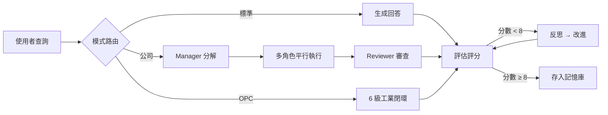

<p align="center">
  <h1 align="center">⚡ EvoLoop</h1>
  <p align="center">
    <strong>自我反思 × 多代理人公司 × 工業閉環</strong>
    <br />
    生成 → 評估 → 反思 → 優化，永不停止進化的 AI 系統
  </p>
</p>

<p align="center">
  
  
  
  
  
  
</p>

---

## 🧠 什麼是 EvoLoop？

EvoLoop 不是一個普通的 AI 助手——它是一個**具備自我反思閉環的多代理人公司運行時**。

- **標準模式**：對每個回答自動評分（0-10），低於 8 分自動進入反思迴圈，迭代改進直到達標
- **公司模式**：Manager 分解任務 → 多角色平行執行 → Reviewer 審查 → Synthesizer 整合，像一家真正的軟體公司運作
- **OPC 模式**：感知 → 預處理 → 分析 → 診斷 → 決策 → 執行，6 級工業閉環
- **雲控制台**：費用帳單、資源監控、告警中心、實例管理——像 AWS 一樣管理你的 AI 基礎設施
- **預算管控**：公司全權控制容器預算，按時計費，壓力過高自動停止非核心服務



---

## 🏗️ 架構總覽

```
┌──────────────────────────────────────────────────┐
│                    🖥️ 前端 (React + Vite)          │
│  ActivityBar │ SidePanel │ MonitorView │ Chat    │
│  雲控制台 · 控制面版 · OPC 監控 · Docker 管理     │
└──────────────────────┬───────────────────────────┘
                       │ REST API
┌──────────────────────┴───────────────────────────┐
│               ⚙️ 後端 (FastAPI + LangGraph)        │
│                                                   │
│  ┌─────────────┐  ┌──────────────┐  ┌──────────┐ │
│  │ 反思閉環     │  │ 公司運行時    │  │ OPC 整合 │ │
│  │ generate     │  │ orchestrator │  │ sense    │ │
│  │ evaluate     │  │ decomposer   │  │ analyze  │ │
│  │ reflect      │  │ reviewer     │  │ diagnose │ │
│  │ improve      │  │ synthesizer  │  │ act      │ │
│  └─────────────┘  └──────────────┘  └──────────┘ │
│                                                   │
│  ┌──────────────────────────────────────────────┐ │
│  │ 雲控制台 (Cloud Console)                      │ │
│  │ CloudBilling · CloudMonitor · CloudAlerts     │ │
│  │ DockerManager · BudgetManager · EventBus      │ │
│  └──────────────────────────────────────────────┘ │
└──────────────────────┬───────────────────────────┘
                       │
┌──────────────────────┴───────────────────────────┐
│               🗄️ 基礎設施 (Docker Compose)         │
│  Redis · ChromaDB · OPC Simulator · Nginx        │
└──────────────────────────────────────────────────┘
```

### 公司模式內部流程

```
Manager 分解目標
  │  TaskDecomposer（LLM / 模板 / 規則 三策略）
  ▼
工作項 DAG（依賴 + 優先級排序）
  │
  ▼
平行執行池（Semaphore 限流，預設 4 並行）
  │  Developer 角色依優先級執行
  ▼
Reviewer 審查閘
  ├─ ✅ 通過 → Done
  └─ ❌ 不通過 → Rework（最多 N 輪，失敗後角色升級）
  ▼
Synthesizer 整合 → Manager 最終審查
  │
  ▼
外部反思迴圈（評估 → 反思 → 改進）
```

---

## 📁 專案結構

```
evoloop/
├── backend/                     # FastAPI 後端 + LangGraph 核心
│   ├── main.py                  #   應用入口（/chat /tasks /dashboard /cloud/*）
│   ├── core/                    #   圖定義、狀態、LLM 調用層
│   │   ├── graph.py             #     反思迴圈圖（標準/公司/OPC 路由）
│   │   ├── nodes.py             #     標準節點（生成/評估/反思/改進）
│   │   ├── company_nodes.py     #     公司節點（路由/執行/收集）
│   │   ├── llm.py               #     LiteLLM 統一調用層
│   │   └── state.py             #     EvoLoopState
│   ├── company/                 #   多代理人公司運行時
│   │   ├── orchestrator.py      #     公司協調器（含 Docker 預算管控）
│   │   ├── decomposer.py        #     任務拆分器（獨立主模組）
│   │   ├── budget.py            #     預算控制 + 模型路由 + Docker 成本
│   │   ├── docker_tools.py      #     Docker 工具定義 + 按時計費費率
│   │   ├── work_item.py         #     工作項狀態機 + 依賴 DAG
│   │   ├── roles.py             #     角色定義 + 組織模板
│   │   ├── events.py            #     EventBus 生命週期事件
│   │   ├── run_log.py           #     持久化運行日誌 (JSONL)
│   │   └── prompts.py           #     Prompt 模板（PromptConfig）
│   ├── services/                #   營運服務
│   │   ├── docker_manager.py    #     Docker 容器管理（SDK 封裝 + Stub 降級）
│   │   ├── cloud_console.py     #     雲控制台（計費/監控/告警/事件）
│   │   ├── task_manager.py      #     後台任務管理器
│   │   ├── dashboard.py         #     控制面版聚合
│   │   └── archiver.py          #     文本化存檔 (JSONL)
│   ├── memory/                  #   向量記憶庫 (ChromaDB)
│   ├── scripts/                 #   工具腳本
│   └── tests/                   #   185 個測試案例
├── opc_service/                 # OPC UA 工業微服務
│   ├── main.py                  #   FastAPI 入口
│   ├── client/                  #   OPC UA 客戶端
│   ├── routes/                  #   REST + WebSocket
│   ├── guard.py                 #   安全護欄（白名單/邊界檢查）
│   └── simulator/               #   模擬 OPC 伺服器
├── frontend/                    # React + Vite + TypeScript
│   └── src/
│       ├── components/          #   UI 組件（IDE 風格佈局）
│       │   ├── CloudConsoleView.tsx  #   雲控制台
│       │   ├── MonitorView.tsx       #   監控視圖
│       │   ├── DockerView.tsx        #   容器管理
│       │   ├── StatusBar.tsx         #   全局狀態欄
│       │   └── ...
│       ├── api/client.ts        #   API 客戶端
│       └── types.ts             #   TypeScript 型別
├── docker-compose.yml           # 五服務編排
├── docker-compose.dev.yml       # 開發模式（熱重載）
└── requirements.txt
```

---

## ✨ 核心能力

### 🔄 反思閉環

| 特性 | 說明 |
|------|------|
| 自動評分 | 0-10 分，門檻可配置（預設 8） |
| 迭代改進 | 最多 N 輪（預設 3），避免無限循環 |
| 記憶注入 | 成功經驗存入 ChromaDB，做 few-shot 參考 |
| 文本存檔 | JSONL 結構化保存，支援審計與回溯 |

### 🏢 多代理人公司

| 特性 | 說明 |
|------|------|
| 層級角色 | Level 0-4，Manager → Tech Lead → Domain Lead → Executor → Support |
| 組織模板 | `page_dev` / `fullstack_app` / `research_report` / `quick_task` / `full_company` |
| 任務拆分 | LLM · 模板 · 規則 三策略，預算壓力下自動降級 |
| 工作項狀態機 | Planning → Ready → Executing → In Review → Rework / Done / Blocked |
| 依賴 DAG | 無依賴並行，有依賴等待上游 |
| 審查閘 | Reviewer 審查不通過 → 退回修改（最多 N 輪） |
| 角色升級 | LLM 失敗後自動升級到上級角色處理 |

### 💰 預算與 Docker 管控（公司全權控制）

| 特性 | 說明 |
|------|------|
| 按時計費 | 阿里雲 ECS 模型：容器 uptime × 小時費率 |
| 預算壓力 | Docker 成本計入公司總預算，影響模型路由決策 |
| 自動優化 | 壓力 ≥ 90% → 自動停止非核心容器；≥ 70% → 建議停止 |
| 費率透明 | 5 種服務費率（backend $0.02/h · opc $0.015/h · frontend $0.01/h · redis $0.005/h · chroma $0.005/h） |
| 成本快照 | 任務開始/結束自動記錄 Docker 成本差異 |

### ☁️ 雲控制台

```
費用帳單                    資源監控
📊 今日/本月/預估費用        📈 CPU · 記憶體 · 網路 SVG 折線圖
各服務費用佔比進度條          1h / 6h / 24h 範圍切換
                             後台 60s 自動輪詢

實例管理                    告警中心
🐳 容器啟停 · 日誌 · 健康     ⚠️ CPU/記憶體閾值規則
按時費率顯示 · 費用計算        JSON 持久化 · 觸發歷史時間線
```

### 🏭 OPC UA 工業整合

| 特性 | 說明 |
|------|------|
| 6 級閉環 | 感知 → 預處理 → 分析 → 診斷 → 決策 → 執行 |
| 安全護欄 | 寫入白名單 + 數值邊界檢查 + 審計日誌 |
| 模擬伺服器 | 內建溫度/壓力/流量/閥門/馬達模擬 |
| 雙協議 | REST API + WebSocket 即時訂閱 |

### 🔧 工程品質

| 特性 | 說明 |
|------|------|
| 事件系統 | 13 種 CompanyEvent，非阻塞 EventBus，監聽器異常不中斷主流程 |
| 檢查點 | 序列化/反序列化完整運行狀態，支援中斷恢復 |
| 後台任務 | 非同步執行，Redis 持久化（TTL 7 天），記憶體降級 |
| 能力註冊表 | 六大能力模組即時狀態一覽 |

---

## 🚀 快速開始

### 環境需求

- **Python** 3.10–3.12
- **Node.js** 20+
- **Docker**（可選，用於容器化部署）

### 一鍵安裝

```powershell
# 1. 虛擬環境
python -m venv .venv
.venv\Scripts\Activate.ps1

# 2. 安裝依賴
pip install -r requirements.txt

# 3. 設定環境變數
copy .env.example .env

# 4. 驗證
python backend/scripts/test_llm_connection.py
pytest backend/tests/ -q
```

### 啟動服務

```powershell
# 後端（含熱重載）
python -m backend.main

# 前端（Vite HMR）
cd frontend && npm install && npm run dev

# OPC 微服務（含模擬伺服器）
$env:OPC_SIM_ENABLED="true"; python -m opc_service.main
```

### Docker Compose 一鍵部署

```powershell
# 開發模式（熱重載）
docker compose up -d

# 僅基礎設施
docker compose up -d redis chroma

# 單獨構建
docker compose up -d --build backend
```

| 服務 | 埠 | 說明 |
|------|-----|------|
| `backend` | 8000 | FastAPI + LangGraph 核心 |
| `frontend` | 5173 / 80 | React + Vite（dev/prod） |
| `opc_service` | 8001 | OPC UA 微服務 |
| `redis` | 6379 | 任務持久化 |
| `chroma` | 8100 | 向量記憶庫 |

---

## ⚙️ 環境變數

| 變數 | 預設值 | 說明 |
|------|--------|------|
| `OPENAI_API_KEY` | — | **必填**，LLM 金鑰（支援 OpenAI / Claude / Gemini） |
| `EVOL_MODEL` | `gpt-4o` | 預設模型 |
| `EVOL_PASS_THRESHOLD` | `8` | 反思迴圈通過門檻 |
| `EVOL_MAX_ITERATIONS` | `3` | 最大迭代次數 |
| `REDIS_URL` | `redis://localhost:6379/0` | Redis 連線 |
| `CHROMA_HOST` / `CHROMA_PORT` | `localhost` / `8100` | ChromaDB 連線 |
| `OPC_SIM_ENABLED` | `false` | 啟用模擬 OPC 伺服器 |
| `OPC_WRITE_WHITELIST` | — | 寫入白名單（逗號分隔） |

---

## 🧪 測試

```powershell
# 全部測試（185 案例，無需 API 金鑰）
pytest backend/tests/ -q

# 分類測試
pytest backend/tests/test_company.py        # 公司模式（預算/角色/事件/檢查點）
pytest backend/tests/test_docker_manager.py # Docker 管理（容器/工具/API）
pytest backend/tests/test_opc_service.py    # OPC 工業閉環
pytest backend/tests/test_reflection_loop.py# 反思迴圈
pytest backend/tests/test_architecture.py   # 架構約束
```

| 測試類別 | 案例數 | 涵蓋範圍 |
|----------|--------|----------|
| 公司模式 | 84 | 工作項狀態機、預算管理、模型路由、任務拆分、事件系統、檢查點、優先級 |
| Docker 管理 | 39 | 容器操作、健康檢查、工具權限、API 端點、Stub 降級 |
| OPC 服務 | 15 | 6 級閉環、安全護欄、審計日誌 |
| 反思迴圈 | 4 | 高分通過、低分迭代、記憶注入 |
| 架構約束 | 8 | LLM 調用層、安全護欄、禁止操作 |
| 控制面版 | 3 | 儀表板聚合、降級安全 |
| 文本存檔 | 4 | JSONL 寫入、反思映射 |

---

## 🛠️ 技術棧

| 層級 | 技術 | 用途 |
|------|------|------|
| 核心閉環 | LangGraph + LiteLLM | 反思迴圈圖 + 多模型路由 |
| 後端 | FastAPI + uvicorn | REST API 服務 |
| 公司運行時 | 自研 (company/) | 多代理人協調 · 預算管控 · Docker 控制 |
| 向量資料庫 | ChromaDB | 記憶存儲與相似檢索 |
| 快取 | Redis | 任務持久化 · 會話狀態 |
| 工業協議 | OPC UA (asyncua) | 工業數據讀寫與訂閱 |
| 容器管理 | Docker SDK | 容器生命週期 · 資源監控 · 按時計費 |
| 前端 | React 18 + Vite + TypeScript | IDE 風格 UI · Tailwind CSS v4 |
| 測試 | pytest + pytest-asyncio | 185 案例 · Mock 隔離 |
| 部署 | Docker Compose | 五服務一鍵編排 |

---

## 🗺️ 路線圖

| 階段 | 內容 | 狀態 |
|------|------|:----:|
| Phase 0 | 環境建設 | ✅ |
| Phase 1 | 核心反思閉環 | ✅ |
| Phase 2 | 向量記憶庫 (ChromaDB) | ✅ |
| Phase 3 | FastAPI 服務 | ✅ |
| Phase 4 | 前端介面 (IDE 風格) | ✅ |
| Phase 5 | DSPy 提示優化 | ⏳ |
| Phase 6 | 多代理人公司運行時 | ✅ |
| Phase 7 | OPC UA 工業整合 | ✅ |
| Phase 8 | 雲控制台 · Docker 預算管控 | ✅ |
| Phase 9 | 文件 · 持續完善 | 🔄 |

---

<p align="center">
  <sub>Built with ❤️ using Python · LangGraph · React · Docker</sub>
</p>