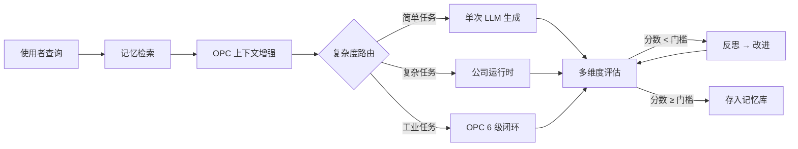

<div align="center">

# 🔄 EvoLoop

**自我反思 × 多代理人公司 × 工业闭环**

生成 → 评估 → 反思 → 优化，永不停止进化的 AI 系统

[](https://www.python.org/)
[](https://fastapi.tiangolo.com/)
[](https://github.com/langchain-ai/langgraph)
[](https://react.dev/)
[](backend/tests/)
[](LICENSE)

</div>

---

## 📖 目录

- [什么是 EvoLoop？](#-什么是-evoloop)
- [架构总览](#️-架构总览)
- [项目结构](#-项目结构)
- [核心能力](#-核心能力)
- [系统优化](#-系统优化)
- [快速开始](#-快速开始)
- [环境变数](#️-环境变数)
- [测试](#-测试)
- [技术栈](#️-技术栈)
- [文档](#-文档)
- [常见问题](#-常见问题)
- [路线图](#️-路线图)

---

## 🧠 什么是 EvoLoop？

EvoLoop 不是一个普通的 AI 助手——它是一个**具备自我反思闭环的统一模式 AI 系统**。反思闭环、公司运行时、OPC 整合三大能力融合在同一条管线中，由系统自动判断执行策略。

| 能力 | 说明 |
|:---:|------|
| 🔄 **反思闭环** | 4 维度独立评分（准确/完整/清晰/相关），低于门槛自动进入反思回圈，迭代改进直到达标 |
| 🏢 **公司运行时** | 复杂任务自动触发：Manager 分解 → 多角色并行执行 → Reviewer 审查 → Synthesizer 整合 |
| 🏭 **OPC 整合** | 工业任务自动注入感测数据上下文，6 级闭环（感知→预处理→分析→诊断→决策→执行），每级带超时降级 |
| ☁️ **云控制台** | 费用账单、资源监控、告警中心、实例管理——像 AWS 一样管理你的 AI 基础设施 |
| 🧠 **语义记忆** | 向量记忆库 + LLM 语义缓存，成功经验自动沉淀为 few-shot 参考 |



---

## 🏗️ 架构总览

```
┌──────────────────────────────────────────────────────────────────┐
│                        🖥️ 前端 (React + Vite)                     │
│    ActivityBar │ SidePanel │ ChatView │ MonitorView │ TraceView  │
│    IDE 风格布局 · 即时任务追踪 · OPC 监控 · 多维评分展示            │
└───────────────────────────────┬──────────────────────────────────┘
                                │ REST API + WebSocket + SSE
┌───────────────────────────────┴──────────────────────────────────┐
│                    ⚙️ 后端 (FastAPI + LangGraph)                  │
│                                                                   │
│  ┌─────────────────┐  ┌─────────────────┐  ┌─────────────────┐   │
│  │    反思闭环      │  │    公司运行时    │  │    OPC 整合     │   │
│  │  ─────────────  │  │  ─────────────  │  │  ─────────────  │   │
│  │  generate       │  │  orchestrator   │  │  sense          │   │
│  │  evaluate       │  │  decomposer     │  │  preprocess     │   │
│  │  reflect        │  │  reviewer       │  │  analyze        │   │
│  │  improve        │  │  synthesizer    │  │  diagnose       │   │
│  │                 │  │  budget         │  │  decide / act   │   │
│  └─────────────────┘  └─────────────────┘  └─────────────────┘   │
│                                                                   │
│  ┌─────────────────────────────────────────────────────────────┐ │
│  │  基础设施：LLMCache · Evaluation · StateStore · VectorMemory │ │
│  │           TaskManager · Archiver · TraceLogger · EventBus   │ │
│  └─────────────────────────────────────────────────────────────┘ │
└───────────────────────────────┬──────────────────────────────────┘
                                │
┌───────────────────────────────┴──────────────────────────────────┐
│                    🗄️ 基础设施 (Docker Compose)                   │
│         Redis · ChromaDB · OPC Simulator · Nginx                 │
└──────────────────────────────────────────────────────────────────┘
```

### 公司运行时内部流程（复杂任务自动触发）

```
Manager 分解目标
  │  TaskDecomposer（LLM / 模板 / 规则 三策略）
  ▼
工作项 DAG（依赖 + 优先级排序）
  │
  ▼
并行执行池（自适应并发控制，响应式调节）
  │  Developer 角色依优先级执行
  ▼
Reviewer 审查闸
  ├─ ✅ 通过 → Done
  └─ ❌ 不通过 → Rework（最多 N 轮，失败后角色升级）
  ▼
Synthesizer 整合 → Manager 最终审查
  │
  ▼
外部反思回圈（多维度评估 → 动态迭代 → 分层反思）
```

---

## 📁 项目结构

```
evoloop/
├── backend/                     # FastAPI 后端 + LangGraph 核心
│   ├── main.py                  #   应用入口（/chat /tasks /dashboard /trace）
│   ├── core/                    #   图定义、状态、LLM 调用层
│   │   ├── graph.py             #     统一模式图（复杂度路由 + 动态迭代）
│   │   ├── nodes.py             #     核心节点（生成/多维评估/分层反思/改进）
│   │   ├── company_nodes.py     #     公司运行时节点（错误回退策略）
│   │   ├── evaluation.py        #     多维度评估引擎（4维评分 + 规则fallback + 交叉评估）
│   │   ├── llm_cache.py         #     LLM 语义缓存（精确匹配 + embedding 语义匹配）
│   │   ├── llm.py               #     LiteLLM 统一调用层（集成缓存）
│   │   └── state.py             #     EvoLoopState（含多维评估类型）
│   ├── company/                 #   多代理人公司运行时
│   │   ├── orchestrator.py      #     公司协调器（自适应并发控制）
│   │   ├── decomposer.py        #     任务拆分器（独立主模组）
│   │   ├── budget.py            #     预算控制 + 模型路由（动态价格配置）
│   │   ├── work_item.py         #     工作项状态机 + 依赖 DAG
│   │   ├── roles.py             #     角色定义 + 组织模板
│   │   ├── events.py            #     EventBus 生命周期事件
│   │   └── prompts.py           #     Prompt 模板（PromptConfig）
│   ├── services/                #   营运服务
│   │   ├── state_store.py       #     统一状态存储接口（Redis/JSONL/Memory）
│   │   ├── task_manager.py      #     后台任务管理器
│   │   ├── trace_logger.py      #     执行轨迹记录器
│   │   ├── dashboard.py         #     控制面版聚合
│   │   └── archiver.py          #     文本化存檔 (JSONL)
│   ├── memory/                  #   向量记忆库 (ChromaDB，自适应阈值)
│   ├── config/                  #   配置文件
│   │   └── model_costs.json     #     模型价格表（支持运行时热更新）
│   ├── prompts/                 #   Prompt 模板
│   └── tests/                   #   185+ 测试案例
├── opc_service/                 # OPC UA 工业微服务
│   ├── graph.py                 #   6 级闭环图（带超时降级 + 人工确认）
│   ├── guard.py                 #   安全护栏（白名单/边界检查）
│   └── simulator/               #   模拟 OPC 伺服器
├── frontend/                    # React + Vite + TypeScript
│   └── src/
│       ├── components/          #   UI 组件（IDE 风格布局）
│       │   ├── ChatView.tsx     #     聊天视图
│       │   ├── MessageBubble.tsx#     消息气泡（含多维评分展示）
│       │   ├── MonitorView.tsx  #     监控视图
│       │   ├── TraceView.tsx    #     执行轨迹
│       │   └── ...
│       ├── api/client.ts        #   API 客户端（SSE + WebSocket）
│       └── types.ts             #   TypeScript 型别（含 MultiDimEvaluation）
├── docs/                        # 📚 知识库
│   ├── architecture/            #   架构文档
│   ├── api/                     #   API 参考
│   ├── config/                  #   配置参考
│   ├── development/             #   开发指南
│   └── deployment/              #   部署指南
├── docker-compose.yml           # 五服务编排
└── requirements.txt
```

---

## ✨ 核心能力

### 🔄 反思闭环（多维度评估）

| 特性 | 说明 |
|------|------|
| **4 维度评分** | 准确性(35%) · 完整性(30%) · 清晰度(20%) · 相关性(15%)，加权总分 0-10 |
| **规则 Fallback** | LLM 评估失败时，使用关键词覆盖率、结构指标等规则启发式评分（不再一律 0 分） |
| **交叉评估** | 可选：不同模型覆核评估结果，打破自评偏差 |
| **动态迭代** | 分数变化率 < 0.5 时提前终止，避免浪费 token |
| **分层反思** | 低分(<5) 深度反思传入完整评估细节；中分(5-8) 表面修正只传入最弱维度摘要 |
| **LLM 语义缓存** | 精确匹配 + embedding 语义匹配（相似度 > 0.92 复用），TTL 1 小时，LRU 淘汰 |
| **记忆注入** | 成功经验存入 ChromaDB（含高分正样本），做 few-shot 参考 |

### 🏢 多代理人公司

| 特性 | 说明 |
|------|------|
| 层级角色 | Level 0-4，Manager → Tech Lead → Domain Lead → Executor → Support |
| 组织模板 | `page_dev` / `fullstack_app` / `research_report` / `quick_task` / `full_company` |
| 任务拆分 | LLM · 模板 · 规则 三策略，预算压力下自动降级 |
| 工作项状态机 | Planning → Ready → Executing → In Review → Rework / Done / Blocked |
| 依赖 DAG | 无依赖并行，有依赖等待上游 |
| 审查闸 | Reviewer 审查不通过 → 退回修改（最多 N 轮） |
| 角色升级 | LLM 失败后自动升级到上级角色处理 |
| **错误回退** | 公司失败但有部分产出 → 降级到反思闭环继续优化（不再直接丢弃） |
| **自适应并发** | 根据 API 响应时间和 429 错误率动态调节并行数 |

### 💰 预算管控

| 特性 | 说明 |
|------|------|
| 模型路由 | 依任务复杂度选择 tier（routine / normal / critical） |
| 预算压力 | 软限制提醒 + 硬限制停止 |
| 成本追踪 | 每笔 LLM 调用记录 token 数与费用 |
| **动态价格** | 模型价格从 `config/model_costs.json` 加载，支持运行时热更新 |
| Docker 成本 | 容器按量计费，纳入月度预算压力计算 |

### 🏭 OPC UA 工业整合

| 特性 | 说明 |
|------|------|
| 6 级闭环 | 感知 → 预处理 → 分析 → 诊断 → 决策 → 执行 |
| 安全护栏 | 写入白名单 + 数值边界检查 + 审计日志 |
| 模拟伺服器 | 内建温度/压力/流量/阀门/马达模拟 |
| 双协议 | REST API + WebSocket 即时订阅 |
| **超时降级** | 每级 30 秒超时，超时后使用上一级缓存结果继续（不再阻断管线） |
| **人工确认** | 可选：关键执行级（act）启用人工确认机制 |

### 🔧 工程品质

| 特性 | 说明 |
|------|------|
| 事件系统 | 13 种 CompanyEvent，非阻塞 EventBus |
| 检查点 | 序列化/反序列化完整运行状态，支援中断恢复 |
| 后台任务 | 非同步执行，Redis 持久化（TTL 7 天），记忆体降级 |
| 执行轨迹 | 完整记录每个节点的输入输出，可视化追踪 |
| **统一状态存储** | 抽象 StateStore 接口，Redis / JSONL / Memory 三后端适配 |
| **SSE 实时反馈** | 串流推送多维评分、迭代进度、早期终止事件 |

---

## 🔬 系统优化

项目已完成 10 项架构级优化：

| # | 方向 | 层级 | 说明 |
|---|------|------|------|
| 1 | **多维度评分** | 🔴 架构 | 4 维度独立评分 + 规则 fallback + 交叉模型评估 |
| 2 | **错误回退** | 🔴 架构 | 公司运行时失败 → 降级到反思闭环（不再直接丢弃） |
| 3 | **LLM 语义缓存** | 🔴 架构 | 精确匹配 + embedding 语义匹配，减少重复 API 调用 |
| 4 | **动态迭代** | 🟡 性能 | 分数变化率检测提前终止 + 分层反思（低分深度/中分表面） |
| 5 | **记忆质量** | 🟡 性能 | 自适应相似度阈值 + 高分正样本也保存 |
| 6 | **自适应并发** | 🟡 性能 | 根据响应时间和 429 错误率动态调节并行数 |
| 7 | **统一状态** | 🟢 工程 | StateStore 抽象接口，Redis/JSONL/Memory 三后端 |
| 8 | **前端实时** | 🟢 工程 | SSE 推送多维评分 + 前端 badge 渲染 |
| 9 | **价格动态化** | 🟢 工程 | 模型价格从 JSON 配置加载，支持运行时热更新 |
| 10 | **OPC 降级** | 🟢 工程 | 每级超时 fallback + 可选人工确认 |

详见 [知识库](docs/README.md)。

---

## 🚀 快速开始

### 环境需求

| 工具 | 版本 | 说明 |
|------|------|------|
| Python | 3.10–3.12 | 后端运行时 |
| Node.js | 20+ | 前端构建 |
| Docker | 可选 | 容器化部署 |

### 1️⃣ 安装

```powershell
# 克隆仓库
git clone https://github.com/iiooiioo888/Evoloop.git
cd Evoloop

# 虚拟环境
python -m venv .venv
.venv\Scripts\Activate.ps1

# 安装依赖
pip install -r requirements.txt

# 设定环境变数
copy .env.example .env
# 编辑 .env 填入你的 API 金钥
```

### 2️⃣ 验证安装

```powershell
# LLM 连线测试
python backend/scripts/test_llm_connection.py

# 运行测试（无需 API 金钥）
pytest backend/tests/ -q
```

### 3️⃣ 启动服务

```powershell
# 后端 API（http://localhost:8000）
python -m backend.main

# 前端（http://localhost:5173）
cd frontend && npm install && npm run dev

# OPC 微服务（可选，含模拟伺服器）
$env:OPC_SIM_ENABLED="true"; python -m opc_service.main
```

### Docker Compose 一键部署

```powershell
# 全部服务
docker compose up -d

# 仅基础设施（Redis + ChromaDB）
docker compose up -d redis chroma

# 查看日志
docker compose logs -f backend
```

| 服务 | 端口 | 说明 |
|------|------|------|
| `backend` | 8000 | FastAPI + LangGraph 核心 |
| `frontend` | 5173 / 80 | React + Vite（dev/prod） |
| `opc_service` | 8001 | OPC UA 微服务 |
| `redis` | 6379 | 任务持久化 |
| `chroma` | 8100 | 向量记忆库 |

---

## ⚙️ 环境变数

### 必填

| 变数 | 预设值 | 说明 |
|------|--------|------|
| `OPENAI_API_KEY` | — | **必填**，LLM 金钥（支援 OpenAI / Claude / Gemini） |

### LLM 与反思

| 变数 | 预设值 | 说明 |
|------|--------|------|
| `EVOL_MODEL` | `gpt-4o` | 预设模型 |
| `EVOL_PASS_THRESHOLD` | `8` | 反思回圈通过门槛 |
| `EVOL_MAX_ITERATIONS` | `3` | 最大迭代次数 |
| `EVOL_MIN_SCORE_IMPROVEMENT` | `0.5` | 最小分数提升（低于此值提前终止） |
| `EVOL_CROSS_EVAL_MODEL` | — | 交叉评估模型（不设置则跳过） |

### LLM 缓存

| 变数 | 预设值 | 说明 |
|------|--------|------|
| `EVOL_LLM_CACHE_SIZE` | `512` | 缓存条目上限 |
| `EVOL_LLM_CACHE_TTL` | `3600` | 缓存 TTL（秒） |
| `EVOL_SEMANTIC_CACHE` | `true` | 是否启用语义缓存 |
| `EVOL_SEMANTIC_THRESHOLD` | `0.92` | 语义相似度阈值 |

### 基础设施

| 变数 | 预设值 | 说明 |
|------|--------|------|
| `REDIS_URL` | `redis://localhost:6379/0` | Redis 连线 |
| `CHROMA_HOST` / `CHROMA_PORT` | `localhost` / `8100` | ChromaDB 连线 |
| `OPC_SIM_ENABLED` | `false` | 启用模拟 OPC 伺服器 |
| `OPC_WRITE_WHITELIST` | — | 写入白名单（逗号分隔） |
| `OPC_STAGE_TIMEOUT` | `30` | OPC 每级超时（秒） |
| `OPC_ACT_HUMAN_CONFIRM` | `false` | OPC 执行级人工确认 |

> 完整配置参考：[docs/config/reference.md](docs/config/reference.md)

---

## 🧪 测试

```powershell
# 全部测试（185+ 案例，无需 API 金钥）
pytest backend/tests/ -q

# 分类测试
pytest backend/tests/test_company.py         # 公司运行时
pytest backend/tests/test_opc_service.py     # OPC 工业闭环
pytest backend/tests/test_reflection_loop.py # 反思回圈
pytest backend/tests/test_architecture.py    # 架构约束
```

| 测试类别 | 案例数 | 涵盖范围 |
|----------|--------|----------|
| 公司运行时 | 84 | 工作项状态机、预算管理、模型路由、任务拆分、事件系统、检查点、优先级 |
| Docker 管理 | 39 | 容器操作、健康检查、工具权限、API 端点、Stub 降级 |
| OPC 服务 | 15 | 6 级闭环、安全护栏、审计日志 |
| 反思回圈 | 4 | 高分通过、低分迭代、记忆注入 |
| 架构约束 | 8 | LLM 调用层、安全护栏、禁止操作 |
| 控制面版 | 3 | 仪表板聚合、降级安全 |
| 文本存档 | 4 | JSONL 写入、反思映射 |

---

## 🛠️ 技术栈

| 层级 | 技术 | 用途 |
|------|------|------|
| 核心闭环 | LangGraph + LiteLLM | 反思回圈图 + 多模型路由 |
| 后端 | FastAPI + uvicorn | REST API 服务 |
| 公司运行时 | 自研 (company/) | 多代理人协调 · 预算管控 |
| 评估引擎 | 自研 (evaluation.py) | 4 维度评分 · 规则 fallback · 交叉评估 |
| 缓存 | 自研 (llm_cache.py) | 精确匹配 + 语义匹配两级缓存 |
| 向量资料库 | ChromaDB | 记忆存储与相似检索（自适应阈值） |
| 快取 | Redis | 任务持久化 · 会话状态 |
| 状态存储 | 自研 (state_store.py) | Redis / JSONL / Memory 统一接口 |
| 工业协议 | OPC UA (asyncua) | 工业数据读写与订阅 |
| 前端 | React 18 + Vite + TypeScript | IDE 风格 UI · Tailwind CSS v4 |
| 测试 | pytest + pytest-asyncio | 185+ 案例 · Mock 隔离 |
| 部署 | Docker Compose | 五服务一键编排 |

---

## 📚 文档

完整知识库位于 [`docs/`](docs/README.md)：

| 文档 | 内容 |
|------|------|
| [架构总览](docs/architecture/overview.md) | 统一管线、三層能力、数据流、目录结构 |
| [反思闭环](docs/architecture/reflection-loop.md) | 多维度评估、动态迭代、分层反思、LLM 缓存 |
| [公司运行时](docs/architecture/company-runtime.md) | 多代理人协调、工作项状态机、预算管控 |
| [OPC 整合](docs/architecture/opc-integration.md) | 6 级闭环、安全护栏、超时降级 |
| [REST API 参考](docs/api/reference.md) | 端点、请求/回应格式、SSE 串流 |
| [配置参考](docs/config/reference.md) | 环境变数、模型价格、.env.example |
| [开发指南](docs/development/guide.md) | 本地环境、测试、扩展点、调试 |
| [部署指南](docs/deployment/guide.md) | Docker Compose、GitHub Pages、生产建议 |

---

## ❓ 常见问题

<details>
<summary><b>Q: 测试失败，出现 OSError: could not create numbered dir</b></summary>

这是 Windows 临时目录权限问题。已在 `pyproject.toml` 中配置使用项目内临时目录：

```toml
[tool.pytest.ini_options]
addopts = "-v --basetemp=.pytest_tmp"
```

如仍有问题，手动指定：`pytest backend/tests/ --basetemp=.pytest_tmp`
</details>

<details>
<summary><b>Q: 支援哪些 LLM 供应商？</b></summary>

通过 LiteLLM 统一调用层，支援：
- OpenAI (GPT-4o, GPT-4, GPT-3.5)
- Anthropic (Claude 3.5/3)
- Google (Gemini Pro/Flash)
- Azure OpenAI
- DeepSeek、Qwen、其他 LiteLLM 支援的模型

只需设定对应的 API Key 环境变量即可。模型价格可从 `backend/config/model_costs.json` 自定义。
</details>

<details>
<summary><b>Q: 如何自定义公司模式的组织模板？</b></summary>

参考 `backend/company/roles.py` 中的模板定义，可通过 `CompanyConfig` 传入自定义角色和模板。详见 `backend/tests/test_company.py` 中的 `TestPromptConfig` 测试案例。
</details>

<details>
<summary><b>Q: OPC 整合需要真实工业设备吗？</b></summary>

不需要。设定 `OPC_SIM_ENABLED=true` 即可使用内建模拟伺服器进行测试。
</details>

<details>
<summary><b>Q: 如何启用交叉评估（第二模型覆核）？</b></summary>

设置环境变量 `EVOL_CROSS_EVAL_MODEL` 为第二个模型名称（如 `deepseek-chat`）。不设置则跳过交叉评估。
</details>

<details>
<summary><b>Q: LLM 缓存如何工作？</b></summary>

两级缓存：
1. **精确匹配**：相同 prompt + system + model 的 SHA256 hash 直接命中
2. **语义匹配**：embedding 余弦相似度 > 0.92 时复用（默认启用，可通过 `EVOL_SEMANTIC_CACHE=false` 关闭）

缓存 TTL 1 小时，上限 512 条，LRU 淘汰。
</details>

---

## 🗺️ 路线图

| 阶段 | 内容 | 状态 |
|------|------|:----:|
| Phase 0 | 环境建设 | ✅ |
| Phase 1 | 核心反思闭环 | ✅ |
| Phase 2 | 向量记忆库 (ChromaDB) | ✅ |
| Phase 3 | FastAPI 服务 | ✅ |
| Phase 4 | 前端介面 (IDE 风格) | ✅ |
| Phase 5 | DSPy 提示优化 | ⏳ |
| Phase 6 | 多代理人公司运行时 | ✅ |
| Phase 7 | OPC UA 工业整合 | ✅ |
| Phase 8 | 执行轨迹可视化 | ✅ |
| Phase 9 | 系统优化（10 项架构改进） | ✅ |
| Phase 10 | 知识库文档 | ✅ |
| Phase 11 | MCP 工具接入 | ⏳ |
| Phase 12 | 记忆蒸馏 + A/B 评估 | ⏳ |

---

<div align="center">

**Built with ❤️ using Python · LangGraph · React · Docker**

[📚 知识库](docs/README.md) · [📡 API 参考](docs/api/reference.md) · [🛠️ 开发指南](docs/development/guide.md) · [🚀 部署指南](docs/deployment/guide.md)

[⬆ 回到顶部](#-evoloop)

</div>
